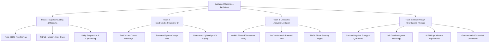

# Multi-Pathway Levitation & Gravitational Physics: Engineering Specification & R&D Monograph

**Document ID:** LEV-ENG-SPEC-2026-001  
**Classification:** Advanced R&D Technical Specification  
**Pathways Covered:** Magnetic/HTS Superconducting Levitation, Electrohydrodynamic (EHD) Thrust, Acoustic Ultrasonic Phased Trapping, Breakthrough Gravitational Physics (Track B)

---

## 1. Executive Architecture & Physical Foundations

The pursuit of sustained, motionless levitation or reactionless-style lift without aerodynamic control surfaces operates across two distinct domains:

1. **Macroscopic Laboratory Engineering Pathways (Tracks 1–3):** Exploitation of electromagnetic, electrodynamic, and acoustic force gradients within Newtonian physics.
2. **Breakthrough Gravitational Physics (Track B):** Metric modification, gravitomagnetism, and stress-energy engineering under General Relativity and Quantum Field Theory.

---

## 2. Track 1: Magnetic & Superconducting Levitation (HTS)

### 2.1 Earnshaw's Theorem & Diamagnetic Bypass
Earnshaw's Theorem (1842) dictates that a static configuration of classical inverse-square forces (electrostatic or magnetostatic) cannot maintain a test body in stable stationary equilibrium in all three Cartesian dimensions:
$$\nabla \cdot \mathbf{F} = \nabla \cdot (-\nabla U) = -\nabla^2 U = 0$$
Because the Laplacian of the potential $\nabla^2 U = 0$ in source-free space, the potential has no local minima—only saddle points.

**Bypass Mechanism:**  
Type-II High-Temperature Superconductors (e.g., $\text{YBa}_2\text{Cu}_3\text{O}_{7-\delta}$, $T_c \approx 93\text{ K}$) bypass Earnshaw's theorem through **magnetic flux pinning (vortex trapping)**:
- In the mixed state ($H_{c1} < H < H_{c2}$), magnetic flux penetrates as quantized Abrikosov vortices ($\Phi_0 = h / 2e \approx 2.067 \times 10^{-15}\text{ Wb}$).
- Structural defects, twin boundaries, and $\text{Y}_2\text{BaCuO}_5$ (211) precipitates act as pinning centers.
- Any displacement $\Delta \mathbf{x}$ requires thermodynamic work to displace vortices across pinning potential energy barriers $U_p$, generating an intrinsic 3D restoring force and restoring torque without sensors or active electronics:
$$\mathbf{F}_{\text{restore}} = -k_z \Delta z\,\hat{\mathbf{z}} - k_x \Delta x\,\hat{\mathbf{x}} - k_y \Delta y\,\hat{\mathbf{y}}$$

### 2.2 Halbach Array Flux Concentration
A 1D/2D Halbach array arranges permanent magnets with a continuous $\pi / 2$ spatial magnetization rotation vector:
$$\mathbf{M}(x) = M_0 \left[ \cos\left(\frac{2\pi x}{\lambda}\right)\hat{\mathbf{z}} + \sin\left(\frac{2\pi x}{\lambda}\right)\hat{\mathbf{x}} \right]$$
This cancels the magnetic field completely on one side ($z < 0$) and doubles the field on the working side ($z > 0$):
$$B_z(x, z) = B_0 \cos(k x) e^{-k z}, \quad B_x(x, z) = -B_0 \sin(k x) e^{-k z}$$
where $k = \frac{2\pi}{\lambda}$ and peak surface field:
$$B_0 = B_r \left[\frac{\sin(\pi/M)}{\pi/M}\right] \left(1 - e^{-k h}\right)$$

### 2.3 Frozen-Image Model & Levitation Force Formulation
Under field-cooled (FC) conditions at height $z_{fc}$, the vertical force on a superconductor of area $A$ at gap $z$ is:
$$F_z(z) = \frac{A B_0^2}{2\mu_0} \left[ e^{-2kz} - e^{-k(z + z_{fc})} \right]$$
Vertical stiffness:
$$k_z = -\frac{\partial F_z}{\partial z} = \frac{k A B_0^2}{\mu_0} \left[ 2e^{-2kz} - e^{-k(z + z_{fc})} \right]$$

### 2.4 50 kg Scale Prototype Engineering
To suspend $M = 50\text{ kg}$ ($W = 490.3\text{ N}$) at an operating gap $z = 8\text{ mm}$ over an N52 Halbach track ($B_0 = 1.05\text{ T}$, $\lambda = 100\text{ mm}$, $k = 62.83\text{ m}^{-1}$):
- Peak magnetic pressure: $P_{mag} = \frac{B(z)^2}{2\mu_0} \approx \frac{(0.635)^2}{2 \times 4\pi \times 10^{-7}} \approx 160.5\text{ kPa}$.
- Net effective vertical pressure with pinning subtraction: $\sim 70\text{ kPa}$.
- Required HTS area: $A_{req} = \frac{490.3\text{ N}}{70,000\text{ N/m}^2} \approx 0.007\text{ m}^2 = 70\text{ cm}^2$.
- Configuration: Array of $14 \times \varnothing 30\text{ mm}$ top-seeded melt-grown (TSMG) YBCO pucks mounted on a closed-loop cryocooled copper cold plate ($T < 77\text{ K}$).

---

## 3. Track 2: Electrohydrodynamic (EHD) Thrust / Ion Propulsion

### 3.1 Physics of Atmospheric Ion Drift
EHD propulsion relies on asymmetric non-equilibrium corona discharge:
1. An intense electric field at a high-curvature anode wire ionizes ambient gas via electron avalanches:
$$e^- + \text{N}_2 \rightarrow 2e^- + \text{N}_2^+$$
2. Free electrons are swept into the anode; positive ions ($\text{N}_2^+, \text{O}_2^+$) migrate across the inter-electrode gap $d$ toward the low-potential cathode collector.
3. Collisions with neutral air molecules transfer momentum via collision cross-sections:
$$F = \int \rho_q \mathbf{E}\, dV = \frac{I \cdot d}{\mu}$$
where $I$ is corona current, $d$ is electrode gap, and $\mu$ is ion mobility ($\approx 2.0 \times 10^{-4}\text{ m}^2/\text{V}\cdot\text{s}$ in standard air).

### 3.2 Peek's Law for Corona Inception
Corona onset occurs when the surface field exceeds the dielectric strength corrected for local air density and wire curvature:
$$E_c = E_0\, m\, \delta \left(1 + \frac{0.0308}{\sqrt{\delta\, r_w}}\right)$$
where $E_0 = 3.1 \times 10^6\text{ V/m}$, $r_w$ is wire radius in cm, $m \approx 0.85\text{–}0.95$ is surface roughness, and $\delta = \frac{P/P_0}{T/T_0}$.  
Inception voltage for wire-to-plane:
$$V_0 = E_c\, r_w \ln\left(\frac{2d}{r_w}\right)$$

### 3.3 Space-Charge Townsend Scaling & Thrust Efficiency
Above $V_0$, current follows the classical quadratic relation:
$$I = C_{geom}\, \mu\, \epsilon_0 \left(\frac{L}{d^2}\right) V (V - V_0)$$
Thrust:
$$T = \frac{I \cdot d}{\mu}$$
Thrust-to-Power ratio ($\theta$):
$$\theta = \frac{T}{P} = \frac{(I \cdot d) / \mu}{I \cdot V} = \frac{d}{\mu V} = \frac{1}{\mu E_{avg}}$$
Crucially, **lower electric field gradients produce higher energy efficiency (N/kW)**, but lower absolute thrust density ($\text{N/m}^2$).

### 3.4 Untethered Flight Threshold Criteria
For autonomous flight without external power umbilical, the net thrust must exceed the combined dry and power plant mass:
$$T > \left( m_{\text{frame}} + m_{\text{HV\_converter}} + m_{\text{battery}} + m_{\text{payload}} \right) g$$
- Modern high-frequency (100 kHz–1 MHz) GaN-based Cockcroft-Walton or planar transformer step-up converters reach specific power densities of $1.5\text{–}2.5\text{ kW/kg}$.
- LiPo batteries deliver $180\text{–}240\text{ Wh/kg}$ at discharge rates exceeding 25C.
- Untethered closure requires operating at $V \approx 30\text{–}45\text{ kV}$ with an optimized wire radius ($r_w \le 30\,\mu\text{m}$) and aerodynamic foil collectors.

---

## 4. Track 3: Ultrasonic Acoustic Levitation

### 4.1 Standing Wave & Radiation Pressure
Two opposed phased ultrasonic transducer arrays (or an array opposite an acoustic reflector) operating at $f = 40\text{ kHz}$ ($\lambda = 8.58\text{ mm}$) produce a 1D/2D stationary acoustic field:
$$p(z, t) = 2 P_0 \cos(k z) \sin(\omega t), \quad v(z, t) = \frac{2 P_0}{\rho_0 c_0} \sin(k z) \cos(\omega t)$$
Standing wave nodes are spaced at intervals of $\Delta z = \frac{\lambda}{2} \approx 4.29\text{ mm}$.

### 4.2 Gor'kov Acoustic Potential Well
For a spherical object of radius $r \ll \lambda$, the primary acoustic radiation force is conservative and derived from the Gor'kov potential $U$:
$$\mathbf{F}_{\text{rad}} = -\nabla U$$
$$U = 2\pi r^3 \left[ \frac{\langle p^2 \rangle}{3 \rho_0 c_0^2} f_1 - \frac{\rho_0 \langle v^2 \rangle}{2} f_2 \right]$$
where:
$$f_1 = 1 - \frac{\rho_0 c_0^2}{\rho_p c_p^2}, \quad f_2 = \frac{2(\rho_p - \rho_0)}{2\rho_p + \rho_0}$$
For solid particles in air ($\rho_p \gg \rho_0$ and $c_p \gg c_0$), $f_1 \approx 1$ and $f_2 \approx 1$.  
The axial force simplifies to:
$$F_z(z) = \frac{5 \pi P_0^2 r^3 k}{6 \rho_0 c_0^2} \sin(2 k z)$$

### 4.3 Physical Limitations & Trap Dynamics
- **Rayleigh Particle Size Limit:** $r \le 0.1 \lambda \implies \varnothing \le 1.7\text{ mm}$ for $40\text{ kHz}$. Above this limit, acoustic scattering becomes non-Rayleigh, producing destabilizing torques.
- **Maximum Levitatable Density:**
$$\rho_{max} = \frac{5 P_0^2 k}{8 \rho_0 c_0^2 g}$$
At Sound Pressure Levels of $160\text{ dB}$ ($P_{rms} \approx 2000\text{ Pa}$, $P_0 \approx 2828\text{ Pa}$), $\rho_{max} \approx 4500\text{ kg/m}^3$, allowing stable suspension of water droplets, polymers, and aluminum grains.

---

## 5. Track B: Breakthrough Gravitational Physics (R&D Roadmap)

### 5.1 Phase 1: Metric Exploration & Casimir Negative Energy Densities
General Relativity metric engineering (such as Alcubierre warp geometries or wormholes) requires stress-energy tensors that violate the Weak Energy Condition (WEC):
$$T_{\mu\nu} u^\mu u^\nu < 0$$
The Casimir cavity between parallel conducting plates exhibits a localized negative energy density:
$$\rho_{\text{Casimir}} = -\frac{\pi^2 \hbar c}{720 d^4}, \quad P_{\text{Casimir}} = -\frac{\pi^2 \hbar c}{240 d^4}$$
At $d = 10\text{ nm}$, $\rho_{\text{Casimir}} \approx -5.2 \times 10^{2}\text{ J/m}^3$.

**The Barrier: Ford-Roman Quantum Energy Inequalities (QEI):**  
Quantum field theory bounds negative energy densities via uncertainty-like relations:
$$\int_{-\infty}^\infty \rho(t) g(t)\, dt \ge -\frac{C \hbar}{t_0^4}$$
Macroscopic negative energy cannot persist indefinitely; any negative pulse must be accompanied by an over-compensating positive energy flux within $\Delta t \le d / c$. Macroscopic static gravitational shielding via Casimir cavities is rigorously constrained.

### 5.2 Phase 2: High-Precision Gravitomagnetic Metrology
In linearized general relativity (Gravitoelectromagnetism / GEM), moving mass currents generate a gravitomagnetic field $\mathbf{B}_g$:
$$\mathbf{B}_g = \nabla \times \mathbf{A}_g \approx \frac{G}{c^2 r^3} \left[ 3(\mathbf{J} \cdot \hat{\mathbf{r}})\hat{\mathbf{r}} - \mathbf{J} \right]$$
For a high-speed laboratory rotor ($M = 10\text{ kg}$, $R = 0.1\text{ m}$, $\omega = 10^3\text{ rad/s}$):
$$J = \frac{1}{2} M R^2 \omega = 50\text{ kg}\cdot\text{m}^2/\text{s}$$
$$B_g \sim \frac{G J}{c^2 r^3} \sim \frac{(6.67 \times 10^{-11}) \times 50}{(9 \times 10^{16}) \times (0.15)^3} \sim 1.1 \times 10^{-26}\text{ s}^{-1}$$
State-of-the-art atomic interferometers and ring-laser gyroscopes achieve precisions of $\sim 10^{-12}\text{ rad/s}$. The laboratory signal is $\mathbf{14\text{ orders of magnitude}}$ below detection thresholds.

### 5.3 Phase 3: Antimatter Gravity Equivalence Principle Verification
Speculative hypotheses posited that antimatter might possess negative gravitational mass ($m_g = -m_i$), experiencing upward "antigravity" in Earth's field.
- **CERN ALPHA-g (September 2023):**  
  Measured magnetically trapped antihydrogen atoms ($\bar{\text{H}}$) dropped under gravity:
  $$a_g = (0.75 \pm 0.13_{\text{stat}} \pm 0.16_{\text{syst}}) g$$
  This demonstrated that antimatter falls downward consistent with standard baryonic gravity and ruled out repulsive antimatter at $>5\sigma$ significance.

### 5.4 Phase 4: High-Field Resonant Coupling (Gertsenshtein Effect)
The Gertsenshtein effect describes the coherent conversion of electromagnetic waves into high-frequency gravitational waves (HFGW) inside a strong transverse magnetic field $B_0$:
$$\eta = \frac{G}{c^4} B_0^2 L^2$$
Because $\frac{G}{c^4} \approx 8.26 \times 10^{-45}\text{ s}^2/(\text{kg}\cdot\text{m})$:
- Even in a 10 Tesla superconducting magnet across a 10-meter beamline:
  $$\eta \approx 8.26 \times 10^{-45} \times 100 \times 100 \approx 8.26 \times 10^{-41}$$
- A Terawatt ($10^{12}\text{ W}$) pulsed laser converts to merely $8.26 \times 10^{-29}\text{ W}$ of gravitational radiation, far below any detectable strain metric $\Delta L / L$.

---

## 6. Comprehensive Bill of Materials (BOM) & Benchtop Specifications

### Track 1: HTS Flux Pinning Benchtop Rig
| Component | Specification | Function |
|---|---|---|
| Superconductor Pucks | $4\times \varnothing 30\text{ mm} \times 12\text{ mm}$ YBCO (TSMG, $J_c > 10^4\text{ A/cm}^2$) | Magnetic flux trapping payload |
| Halbach Track | $32\times 25\text{ mm} \times 25\text{ mm} \times 25\text{ mm}$ NdFeB N52 Magnets | Upward-concentrated magnetic rail |
| Cryostat / Dewar | Non-magnetic G10 fiberglass / thin stainless vacuum vessel | Liquid nitrogen ($77\text{ K}$) containment |
| Cryogenic Monitoring | PT100 RTD sensor + 4-wire LakeShore monitor | Temperature tracking across $T_c$ |

### Track 2: Untethered EHD Lifter Rig
| Component | Specification | Function |
|---|---|---|
| Emitter Wire | $30\text{–}50\,\mu\text{m}$ Tungsten or stainless corona wire | High-curvature corona ionization |
| Ground Collector | 0.05 mm Al foil wrapped balsa aerofoil ($d = 35\text{–}50\text{ mm}$) | Smooth momentum collector |
| High-Voltage Step-Up | Ultra-lightweight planar transformer + 6-stage Cockcroft-Walton ($0\text{–}40\text{ kV}$) | High voltage ionization drive |
| Power Source | 2S/3S LiPo 300 mAh 75C battery | Onboard power supply |

### Track 3: 40 kHz Ultrasonic Acoustic Array
| Component | Specification | Function |
|---|---|---|
| Transducers | $2\times 64$ Manifold 400ST160 $40\text{ kHz}$ piezoelectric transducers | Opposed phased array drivers |
| Driver Stage | TC4427 / L298N Dual Full-Bridge MOSFET Drivers | 16–24 Vpp square wave array drive |
| Processing Unit | Altera Cyclone IV FPGA or STM32H7 MCU | Precise microsecond phase-shift modulation |
| Enclosure | Acoustic reflection dampening chamber | Eliminates external air cross-currents |

---

## 7. Safety Engineering & Compliance Protocols

1. **Cryogenic Safety (Track 1):**
   - Liquid Nitrogen ($77\text{ K}$) causes rapid tissue damage and cryo-burns. Face shields and cryogenic gloves mandatory.
   - 1 Liter of $LN_2$ expands to $\sim 694\text{ Liters}$ of gas at room temperature. Mandatory oxygen depletion sensors ($\text{O}_2 > 19.5\%$) in enclosed spaces.
2. **High Voltage & Ozone Mitigation (Track 2):**
   - High-voltage DC ($20\text{–}50\text{ kV}$) presents lethal electric shock and arc-flash risks. Automated bleeder resistors and interlock cages required.
   - Atmospheric corona produces ozone ($\text{O}_3$) and nitric oxides ($\text{NO}_x$). Enclosure must feature active HEPA + activated carbon exhaust ventilation.
3. **Ultrasonic Exposure (Track 3):**
   - Acoustic levitation at $150\text{–}165\text{ dB SPL}$ can cause permanent hearing damage, tinnitus, and vestibular nausea even at inaudible $40\text{ kHz}$.
   - Operators must wear certified high-frequency earmuffs (attenuation $\ge 35\text{ dB}$ at $40\text{ kHz}$) and operate behind acrylic blast shielding.
